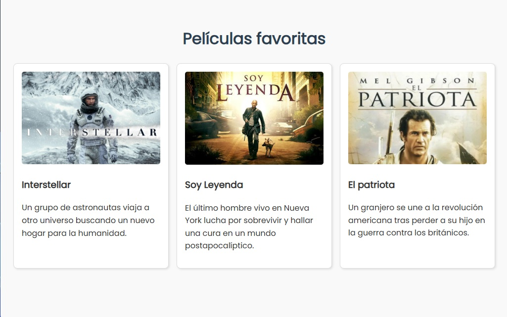
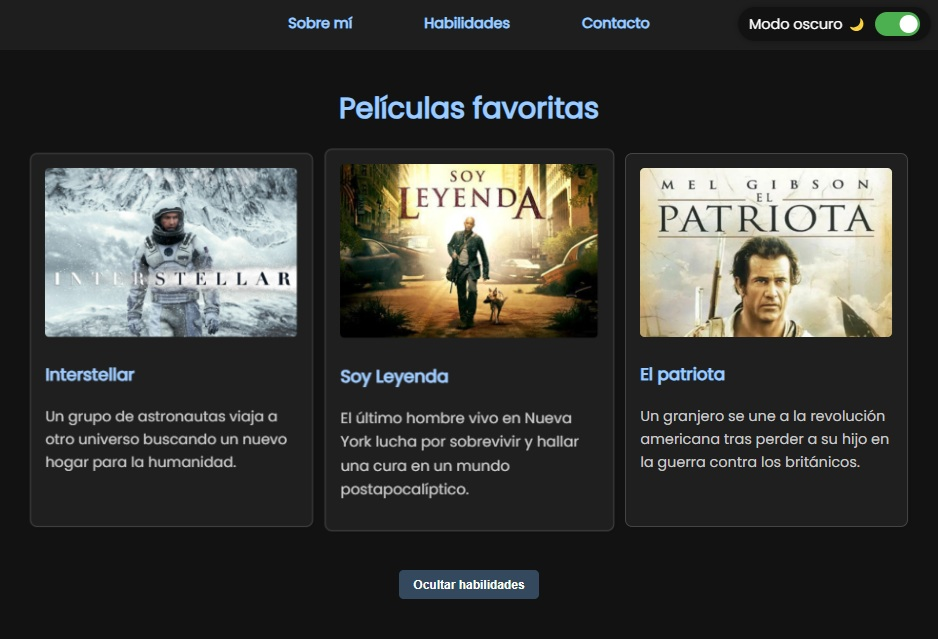
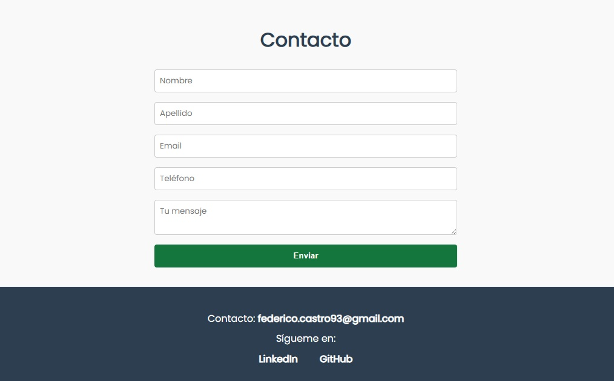
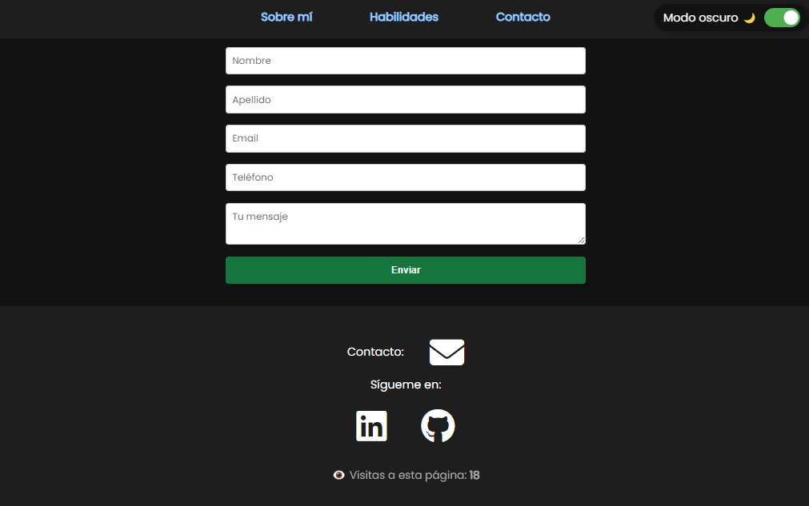

# PFO2 – Portafolio Interactivo

Este proyecto es una evolución del portafolio realizado en la PFO1. El objetivo fue incorporar al menos 5 funcionalidades con JavaScript que mejoren la interacción con el usuario y, además, aplicar mejoras visuales y estructurales respecto al diseño anterior.

## Funcionalidades JavaScript implementadas (Punto 1)

1. [✓] Validación personalizada del formulario de contacto
2. [✓] Pop-up de confirmación de envío
3. [✓] Modo oscuro / claro con switch e ícono dinámico
4. [✓] Mostrar / ocultar sección de habilidades con animación
5. [✓] Creación dinámica de tarjetas de películas favoritas
6. [✓] Contador de visitas con localStorage

## Mejoras visuales y estructurales (Punto 2)

🔹 Mejora 1: Menú de navegación sticky

El menú principal ahora permanece fijo en la parte superior de la página gracias al uso de `position: sticky`. Esto facilita la navegación sin importar en qué parte del sitio esté el usuario.

**Antes:**

**Después:**

🔹 Mejora 2: Rediseño del footer con íconos

El pie de página fue rediseñado para mostrar íconos visuales representando los medios de contacto: Gmail, LinkedIn y GitHub. Se utilizó la biblioteca Font Awesome para estilizar y alinear mejor los enlaces. El correo electrónico ahora se representa solo con un ícono.

**Antes:**

**Después:**

## ¿Cómo ver el proyecto?

Podés acceder al sitio publicado en GitHub Pages desde este enlace:

[Ver sitio](https://castrofederico93.github.io/FrontEnd_PFO2/)
